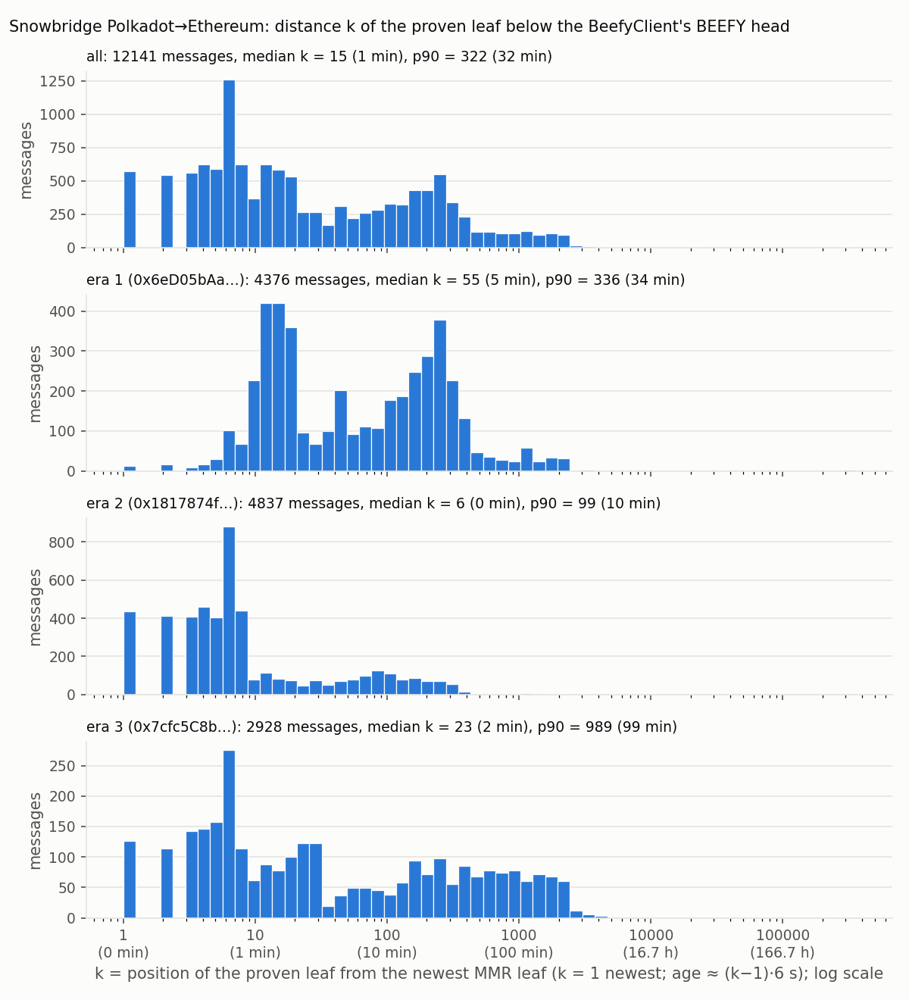
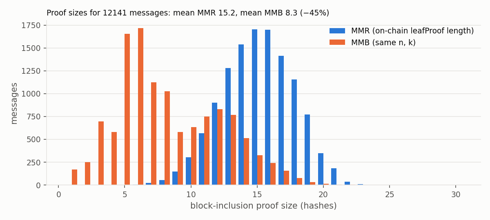
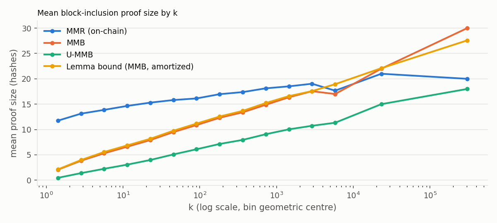
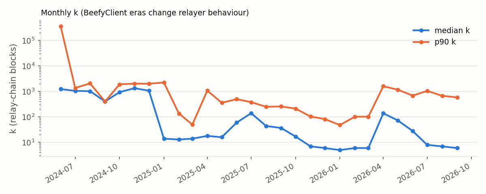

#+TITLE: Snowbridge Polkadot→Ethereum messages: measured k and MMR-vs-MMB proof sizes
#+SUBTITLE: Report for the MMB paper, Appendix "Cross-chain bridges and Polkadot"
#+DATE: 2026-09-25
#+OPTIONS: toc:2 ^:nil

Generated by =report.py= from the outputs of =snowbridge_k.py= and =analyse.py= (all numbers are
computed, none typed). Data window: 2024-06-05 … 2026-09-25, 12,141 messages.
Provenance: collector run 0775b23a-7e73-4dd1-917d-84e520cea62f at 2026-09-25T09:28:10+00:00 (repo commit 49e730dc63c1,
decoder v2, sources: logs via Etherscan, tx/call via Rpc); analysis at 2026-09-25T10:42:22+00:00;
MMB reference implementation commit 1fa9839b4c79; upstream sources {'Snowfork/snowbridge': 'e65a6a9451a86b027e9d17706ac3917bdbdff697', 'paritytech/polkadot-sdk': 'cccea0c9393792a97a7814b88ca73a7678c43fc7', 'nervosnetwork/merkle-mountain-range': 'master 2026-09-24'}.

* Summary
- Polkadot's BEEFY commitment is an *MMR* (pallet_mmr on ckb =merkle-mountain-range=), not a balanced
  tree, and it only started at relay block 19,551,001: today it holds n ≈ 13,600,938 leaves
  (≈ 2^23.7), not 2^25. The paper's "25 hashes" baseline must be replaced by the MMR baseline.
- Every =InboundMessageDispatched= log of the Snowbridge Gateway on Ethereum mainnet was collected
  (12141 logs, 2024-06-05 … 2026-09-25); 12,141 of them (100.0%) could be decoded
  (direct Gateway calls, aggregate3 batches, or a calldata scan of third-party wrapper contracts); the
  remainder is listed in =data/undecoded_dispatches.csv= ({}).
  For each decoded message we know the exact leaf proven, the BEEFY root it was verified against, and
  the on-chain MMR proof length. The on-chain proof length agrees with the ckb-mmr proof-size formula
  for all 12,141 messages (0 mismatches), which validates the leaf indexing, the leaf-count
  offset and the era mapping end to end.
- The block-inclusion proof is one of three proof components; the other two are unchanged by MMB:
  parachain-heads proof mean 5.1 hashes, message Merkle proof mean
  0.03 hashes (most blocks carry a single message), against
  15.2 for the MMR block-inclusion proof.
- k (paper convention, k = 1 = newest leaf): median 15, p90 322; 573 messages were proven at
  the newest leaf. In the best-tuned period (era 2) the median is 6 and k is flat on 1…8
  (counts [435, 412, 410, 460, 404, 460, 423, 440]).
- Why: two pieces of open-source code. (1) polkadot-sdk's BEEFY voter, once caught up, votes every
  =min_block_delta= = 8 blocks on Polkadot (=polkadot/node/service/src/builder/mod.rs= =min_block_delta: 8=;
  =substrate/client/consensus/beefy/src/worker.rs= =vote_target=: target = best_beefy + max(min_delta,
  next_power_of_two((best_grandpa − best_beefy + 1)/2))). (2) Snowbridge's on-demand BEEFY relayer takes,
  for each pending message, the *first* BEEFY commitment after the message's relay-chain inclusion block
  (=relayer/relays/beefy/on-demand-sync.go= =queue()= → =polkadot-listener.go= =findNextBeefyBlock=), and
  the message relayer proves the message against exactly that root. Hence k = (next BEEFY block) −
  (inclusion block) ∈ {1,…,8} whenever BEEFY is caught up, uniformly. Nothing in either code base
  targets short MMR proofs; small k is a side effect of relaying the earliest usable commitment.
- Savings at the observed workload: MMR proofs average 15.2 hashes (median 15, max 23);
  MMB would average 8.3 (median 7); median per-message saving 50% (7 hashes); MMB is shorter for
  97.9% of messages. For k ≤ 8 (the caught-up regime) the MMB proof averages
  2.07–5.30 hashes against 11.74–13.87 for MMR.
- Larger k comes from operator behaviour, not protocol: the scheduler may merge a queued BEEFY update
  into a later one (=merge-period= ≤ 1800 s, =expired-period= ≤ 14400 s), the dominant era-3 relayer
  does so heavily (median k in the tens, p90 ≈ 1000), and 2 launch-day message(s) sit at
  k ≈ 355,082. Fiat–Shamir submission (era 3) removed the RANDAO delay: BEEFY update and message land
  in the same Ethereum block.

* Results
** Per era (BeefyClient contract in use on Ethereum)
|                                 | all                                       | era 1 (0x6eD05bAa…)                       | era 2 (0x1817874f…)                   | era 3 (0x7cfc5C8b…)                     |
|---------------------------------|-------------------------------------------|-------------------------------------------|---------------------------------------|-----------------------------------------|
| messages                        | 12141                                     | 4376                                      | 4837                                  | 2928                                    |
| relayers (distinct sender keys) | 28                                        | 16                                        | 13                                    | 7                                       |
| dispatches with success = false | 8                                         | 3                                         | 4                                     | 1                                       |
| k median                        | 15                                        | 55                                        | 6                                     | 23                                      |
| k mean                          | 204.3                                     | 336.0                                     | 36.0                                  | 285.7                                   |
| k p90                           | 322                                       | 336                                       | 99                                    | 989                                     |
| k p99                           | 1983                                      | 1900                                      | 336                                   | 2339                                    |
| k max                           | 355,082                                   | 355,082                                   | 4,963                                 | 4,593                                   |
| share k ≤ 50 / ≤ 600 / ≤ 1800   | 65% / 94% / 99%                           | 49% / 95% / 99%                           | 83% / 100% / 100%                     | 58% / 84% / 96%                         |
| MMR leaf count n (min … max)    | 1,537,749 … 13,600,938                    | 1,537,749 … 8,654,567                     | 8,655,391 … 11,186,846                | 11,187,718 … 13,600,938                 |
| MMR proof: median / mean / max  | 15 / 15.2 / 23                            | 16 / 16.1 / 23                            | 14 / 13.8 / 21                        | 16 / 16.0 / 23                          |
| MMB proof: median / mean / max  | 7 / 8.3 / 30                              | 10 / 10.0 / 30                            | 6 / 6.2 / 19                          | 8 / 9.2 / 23                            |
| U-MMB proof mean                | 4.3                                       | 5.5                                       | 2.9                                   | 5.0                                     |
| Lemma lem:a-mmb bound, mean     | 8.5                                       | 10.3                                      | 6.4                                   | 9.4                                     |
| balanced tree ⌈log₂ n⌉, mean    | 23.7                                      | 23.1                                      | 24.0                                  | 24.0                                    |
| saving of means                 | 45%                                       | 38%                                       | 55%                                   | 43%                                     |
| median per-message saving       | 50% (7 hashes)                            | 38% (6 hashes)                            | 60% (8 hashes)                        | 47% (7 hashes)                          |
| best / worst per-message saving | 94% (17→1, k=1) / -50% (20→30, k=355,082) | 93% (15→1, k=1) / -50% (20→30, k=355,082) | 94% (17→1, k=1) / -25% (12→15, k=143) | 94% (16→1, k=1) / -20% (15→18, k=2,419) |
| messages where MMB is shorter   | 97.9%                                     | 96.7%                                     | 99.0%                                 | 98.0%                                   |

k in relay-chain blocks (6 s; age ≈ (k−1)·6 s). Proof sizes in hashes (block-inclusion proof only;
the parachain-heads proof and the message Merkle proof are unchanged by MMB). MMB sizes are exact
values of the paper's reference implementation (=proof-size= in merkle-mountain-belt-clj) at each
message's actual (n, k). "Balanced tree" is the paper's previous baseline ⌈log₂ n⌉.

** Proof size as a function of k (all messages)
| k from | k to   | messages | MMR mean | MMB mean | U-MMB mean | lemma | balanced |
|--------|--------|----------|----------|----------|------------|-------|----------|
| 1      | 1      | 573      | 11.74    | 2.07     | 0.47       | 2.12  | 23.99    |
| 2      | 3      | 1104     | 13.13    | 3.84     | 1.39       | 3.98  | 23.98    |
| 4      | 7      | 2473     | 13.87    | 5.30     | 2.25       | 5.56  | 23.95    |
| 8      | 15     | 2003     | 14.65    | 6.60     | 3.06       | 6.86  | 23.59    |
| 16     | 31     | 1208     | 15.30    | 7.91     | 3.98       | 8.17  | 23.60    |
| 32     | 63     | 772      | 15.81    | 9.49     | 5.08       | 9.76  | 23.53    |
| 64     | 127    | 943      | 16.13    | 10.87    | 6.10       | 11.17 | 23.61    |
| 128    | 255    | 1374     | 16.97    | 12.31    | 7.15       | 12.56 | 23.47    |
| 256    | 511    | 893      | 17.38    | 13.39    | 7.95       | 13.67 | 23.41    |
| 512    | 1023   | 353      | 18.12    | 14.88    | 9.07       | 15.23 | 23.67    |
| 1024   | 2047   | 338      | 18.51    | 16.36    | 10.03      | 16.59 | 23.53    |
| 2048   | 4095   | 101      | 19.03    | 17.55    | 10.73      | 17.58 | 23.66    |
| 4096   | 8191   | 3        | 17.67    | 17.00    | 11.33      | 18.94 | 24.00    |
| 16384  | 32767  | 1        | 21.00    | 22.00    | 15.00      | 22.10 | 23.00    |
| 262144 | 355082 | 2        | 20.00    | 30.00    | 18.00      | 27.58 | 21.00    |

** Scheduling fingerprints
| era                 | NewMMRRoot events | messages | roots used | msgs / used root | update→dispatch gap p50 (s) | p90 (s) | root in same tx | same block | k ≤ 8 |
|---------------------|-------------------|----------|------------|------------------|-----------------------------|---------|-----------------|------------|-------|
| era 1 (0x6eD05bAa…) | 6131              | 4376     | 3288       | 1.33             | 36                          | 372     | 0.0%            | 0.0%       | 5.8%  |
| era 2 (0x1817874f…) | 4954              | 4837     | 3716       | 1.30             | 24                          | 108     | 0.0%            | 0.0%       | 71.2% |
| era 3 (0x7cfc5C8b…) | 2880              | 2928     | 2018       | 1.45             | 0                           | 0       | 93.0%           | 93.0%      | 36.7% |

About one BEEFY update per message; the update precedes the message by seconds. In era 3 the BEEFY
update and the message are typically submitted in the same Ethereum transaction (Fiat–Shamir
single-transaction updates); the "root in same tx" column is the direct measurement.

** k by relayer (sender of the Gateway submit transaction; ≥ 20 messages)
| era                 | relayer     | messages | k median | k mean | k p90 |
|---------------------|-------------|----------|----------|--------|-------|
| era 1 (0x6eD05bAa…) | 0x1f1819c3… | 2332     | 54       | 462    | 295   |
| era 1 (0x6eD05bAa…) | 0xc0606dfc… | 700      | 70       | 201    | 398   |
| era 1 (0x6eD05bAa…) | 0x5709fab0… | 433      | 56       | 166    | 360   |
| era 1 (0x6eD05bAa…) | 0xec3cb8b3… | 426      | 60       | 198    | 443   |
| era 1 (0x6eD05bAa…) | 0x302f0b71… | 311      | 50       | 95     | 247   |
| era 1 (0x6eD05bAa…) | 0x091229c0… | 139      | 22       | 69     | 188   |
| era 2 (0x1817874f…) | 0x1f1819c3… | 3119     | 6        | 32     | 97    |
| era 2 (0x1817874f…) | 0x091229c0… | 1295     | 6        | 38     | 99    |
| era 2 (0x1817874f…) | 0xc0606dfc… | 202      | 7        | 52     | 187   |
| era 2 (0x1817874f…) | 0xa33b73f3… | 60       | 5        | 10     | 8     |
| era 2 (0x1817874f…) | 0xba9bc9a8… | 55       | 6        | 125    | 75    |
| era 2 (0x1817874f…) | 0x6a57bb24… | 52       | 4        | 98     | 94    |
| era 2 (0x1817874f…) | 0x30f4c4ce… | 23       | 6        | 22     | 20    |
| era 3 (0x7cfc5C8b…) | 0xba9bc9a8… | 2526     | 31       | 318    | 1088  |
| era 3 (0x7cfc5C8b…) | 0xc633a00f… | 343      | 5        | 5      | 8     |
| era 3 (0x7cfc5C8b…) | 0x091229c0… | 45       | 140      | 665    | 2564  |

Era 3's larger mean is not a start-of-era transient (its weekly mean k stays in the hundreds
throughout) but coincides with one sender key dominating after relayer decentralization (Snowbridge
PR #1696, 2026-02). Relayers are identified by the transaction sender (EOA); batching contracts
(aggregate3-style) are unwrapped, so the sender is the operator's key, but one key may serve several
operators or vice versa, and the era-3 conclusion rests on a single key.

** Figures
-  — k per era (log-x)
-  — on-chain MMR vs MMB proof-size distributions
-  — mean proof size by k (MMR, MMB, U-MMB, lemma bound)
-  — monthly median/p90 k (on-demand relaying from 2025-01)

* Method and validation
- Ethereum: all =InboundMessageDispatched= (v1, v2) logs of the Gateway proxy
  =0x27ca963c…= via Etherscan; each dispatch transaction decoded (=submitV1= / =v2_submit=,
  ABI from =contracts/src/Verification.sol=, =v1/Types.sol=, =v2/Types.sol=) to obtain
  =leafPartial.parentNumber= (proven leaf = relay block parentNumber + 1), =leafProof.length=,
  =leafProofOrder=, parachain header number. Dispatch logs matched to calls by nonce (+ channel).
- BeefyClient eras from the proxy's =Upgraded(address)= events and =BEEFY_CLIENT()= on each
  implementation (three clients: 0x6eD05bAa…, 0x1817874f…, 0x7cfc5C8b…); =latestBeefyBlock= at each
  dispatch from the =NewMMRRoot= events of the client in use (=submitFinal= and =submitFiatShamir=
  both emit it). A dispatch log exists only if =verifyMMRLeafProof= succeeded against the single
  stored =latestMMRRoot= (=BeefyClient.sol=), so the root in effect at the log position is the one
  the proof was checked against.
- Polkadot: =Mmr.NumberOfLeaves(B) = B − 19,551,000= (verified at run time: block 21088749: NumberOfLeaves 1,537,749 OK; block 28782936: NumberOfLeaves 9,231,936 OK; block 33151938: NumberOfLeaves 13,600,938 OK), so
  n = latestBeefyBlock − 19,551,000, i = parentNumber − 19,551,000, k = n − i. The per-message formula
  check is the systematic backstop: a wrong offset would break it for a large fraction of messages.
- MMR proof-size formula (ckb =gen_proof=): h + (#peaks left of the leaf's mountain) + [any peak to
  the right]; verified by brute force for n ≤ 300 and against all 12,141 on-chain proofs.
- MMB sizes: =proof-size n k= (k = 1 newest), calibrated row-for-row against
  =stats/k-vs-n-no-phantom.csv= for n ≤ 512.

* Implications for the paper (zapps.tex, "Cross-chain bridges and Polkadot"; zintro.tex bridge row)
- Replace the balanced-tree baseline (25 hashes) by the MMR baseline; use n ≈ 2^23.7 (MMR leaves).
- Replace the assumed periodic checkpoint ("every 3 hours", C = 1800) by the actual regime:
  on-demand checkpointing with k ∈ {1,…,8} when BEEFY is caught up, derived from the two code
  references above; keep the periodic regime as the conservative alternative.
- Quote the measured distribution as an existence proof of the workload: median k 15,
  94% within 600, MMR 15.2 → MMB 8.3 hashes on average, 50% (7 hashes) median saving.
- Consequence for zintro.tex "25 to 13 hashes": measured MMR 15 (median) vs MMB 7 (median); for
  the caught-up regime the Variant-2 worst case with C = 8 is ⌊log₂ 8⌋ + 3 = 6 hashes.

* Caveats
- MMB numbers are counterfactual: same leaf sequence and same (n, k), MMB instead of MMR.
- Data are Ethereum-side only; k measures the distance to the BEEFY head *on Ethereum*, which is
  what the proof size depends on.
- Messages whose transaction went through a wrapper contract that does not embed the Gateway call
  verbatim cannot be decoded without execution traces; they are listed, not silently dropped.
- 2 launch-day message(s) (k > 100,000; all in ['2024-06']) pull the overall mean k from
  145.9 to 204.3; MMB is worse than MMR by more than 25% for 7 messages
  (5 of them not launch-day, worst -43%).
- Operator behaviour changes over time (three BeefyClient eras, relayer decentralization); the
  caught-up regime is a property of the code, the tail is a property of operators.

* Reproduction
#+begin_src bash
nix develop                                   # repository root: JDK, Clojure and the Python packages
cd studies/snowbridge
python3 -m unittest -v test_snowbridge_k      # decoding, wrapper scan, era rules, MMR formula
export ETHERSCAN_API_KEY=…                    # logs (free tier: 3 calls/s)
export RPC=https://eth-mainnet.g.alchemy.com/v2/…   # optional: tx/call lookups (any tier)
python3 snowbridge_k.py                       # data/snowbridge_messages.csv (raw results cached in data/cache/)
python3 analyse.py                            # figures/, snowbridge-k-analysis.org (MMB sizes via clojure -M:mmb-sizes)
python3 report.py                             # this report
#+end_src
Upstream sources and commits are recorded in =data/run_summary.json= (=source_commits=).
